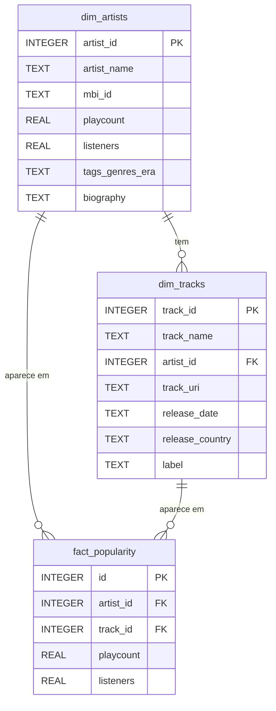

# Modelo de Dados — Star Schema (Camada Gold)

## Estratégia de Modelação

Foi adotado um **Star Schema** (esquema em estrela), modelo dimensional clássico para cargas analíticas. Este modelo é adequado para o nosso caso porque:

- O domínio é naturalmente dimensional: métricas de popularidade (`fact_popularity`) relacionadas com artistas e faixas.
- Facilita queries analíticas diretas para o dashboard (agregações por artista, género, país).
- É compatível com ferramentas de visualização (Streamlit, Power BI, etc.) sem necessidade de joins complexos.

O motor escolhido foi o **SQLite**, por ser um ficheiro único sem necessidade de servidor, totalmente executável em ambiente local, e compatível com as bibliotecas Python utilizadas no projeto (`sqlite3`, `pandas`).

## Diagrama ER

## Decisões Técnicas

| Decisão | Escolha | Justificação |
|---------|---------|--------------|
| Motor | SQLite | Execução local sem servidor; ficheiro único portátil |
| Modelo | Star Schema | Otimizado para queries analíticas OLAP |
| Chaves primárias | Surrogate keys (INTEGER) | Independência de dados fonte, performance de join |
| Índices | `artist_id`, `track_id` na fact | Aceleração das queries mais comuns do dashboard |
| Foreign Keys | Ativadas via PRAGMA | Garantia de integridade referencial |
| Nulos | Preservados como NULL | Representam amostragem incompleta das APIs (documentado no relatório de qualidade) |

## Camadas do Pipeline (Medallion)

| Camada | Localização | Descrição |
|--------|-------------|-----------|
| Bronze/Raw | `data/raw/` | Dados brutos extraídos das fontes sem alteração |
| Silver | `data/silver/dataset_integrado.csv` | Dataset limpo, normalizado e integrado |
| Gold | `data/gold/` + `data/music_analytics.db` | Modelo dimensional pronto para análise |
